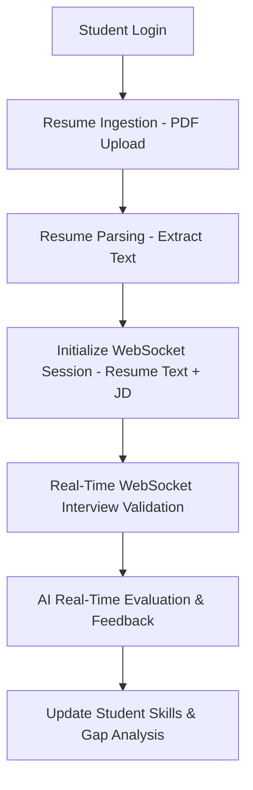

# SATA Career Intelligence Platform - Agent State

This document is the single source of truth for the active state of the SATA (Student Academic Tracking & Analytics) to Career Intelligence Platform pivot.

---

## 1. Active Core Workflow (Proposed Pivot)

The platform is pivoting from academic tracking (grades/subjects) to a pure, enterprise-grade B.Tech Career Intelligence Platform. The key workflow transitions from a batch-oriented HTTP Q&A setup to a real-time, interactive validation model.

### Path Components
1. **Resume Ingestion**: Student uploads a PDF resume. The system extracts plaintext using a parser endpoint (`/api/interview/sessions/parse-resume`).
2. **Session Creation**: Student provides a target Job Description (JD). The system starts an interview session. In the new model, this session will initialize a WebSocket connection.
3. **Real-Time WebSocket Validation**:
   - The server pushes interview questions tailored to the student's extracted skills, projects, and target role/JD.
   - The student answers questions via voice-to-text (Web Speech API) in real-time.
   - The WebSocket validates incoming audio/text chunks, performs real-time sentiment or accuracy checks, and streams question-by-question updates.
4. **Interactive Feedback & Evaluation**: Dynamic real-time scoring and feedback streaming over the connection, updating student skill metrics dynamically.

---

## 2. Database State (Active PostgreSQL Tables)

### User & Core Models
#### `users`
- `id` (UUID, PK)
- `student_id` (String(50), Unique, Indexed, Nullable)
- `email` (String(255), Unique, Indexed, Nullable=False)
- `password_hash` (String(255), Nullable=False)
- `is_active` (Boolean, Default=True)
- `role` (Enum: student, admin, faculty, Default=student)
- `failed_login_attempts` (Integer, Default=0)
- `locked_until` (DateTime, Nullable=True)
- `created_at` (DateTime, timezone=True)
- `updated_at` (DateTime, timezone=True)

#### `student_profiles`
- `id` (UUID, PK)
- `user_id` (UUID, FK `users.id`, Unique, Nullable=False)
- `name` (String(255), Nullable=False)
- `department` (String(255), Nullable=False)
- `semester` (Integer, Nullable=False)
- `interests` (Text, Nullable=True)
- `cgpa_10scale` (Numeric(4, 2), Nullable=True)
- `batch_year` (Integer, Nullable=True)
- `performance_status` (String(20), Nullable=True)
- `backlog_count` (Integer, Default=0)
- `active_backlog` (Boolean, Default=False)
- `cgpa` (Numeric(4, 2), Nullable=True)
- `created_at` (DateTime, timezone=True)
- `updated_at` (DateTime, timezone=True)

#### `academic_terms` [DELETED]
- Tablename dropped. No longer exists in the schema.

#### `subjects` [DELETED]
- Tablename dropped. No longer exists in the schema.

### Career & Skill Models
#### `skill_taxonomy`
- `id` (UUID, PK)
- `skill_name` (String(100), Unique, Nullable=False)
- `category` (String(50), Nullable=False)
- `aliases` (ARRAY(Text))
- `description` (Text)
- `skill_type` (String(20), Default='concept')
- `parent_id` (UUID, FK `skill_taxonomy.id`, Nullable=True)
- `created_at` (DateTime)

#### `student_projects`
- `id` (UUID, PK)
- `user_id` (UUID, FK `users.id`, Nullable=False)
- `title` (String(255), Nullable=False)
- `description` (Text)
- `tech_stack` (ARRAY(Text))
- `domain` (String(100))
- `complexity` (String(20))
- `project_url` (String(500))
- `completed_at` (Date)
- `repo_url` (String(255), Nullable=True, GitHub Domain validated)
- `extracted_skills` (JSONB, Nullable=True)
- `calculated_complexity` (Integer, Nullable=True)
- `analyzed_at` (DateTime, Nullable=True)

#### `student_preferences`
- `id` (UUID, PK)
- `user_id` (UUID, FK `users.id`, Unique, Nullable=False)
- `target_roles` (ARRAY(String))
- `preferred_domains` (ARRAY(String))
- `open_to_remote` (Boolean, Default=True)
- `career_transition` (Boolean, Default=False)
- `transition_from` (String(100))
- `transition_to` (String(100))
- `timeline_months` (Integer)
- `experience_level` (String(20))

#### `student_skills`
- `id` (UUID, PK)
- `user_id` (UUID, FK `users.id`, Nullable=False)
- `skill_id` (UUID, FK `skill_taxonomy.id`, Nullable=False)
- `confidence_score` (Numeric(5, 2), Default=0)
- `level` (String(20))
- `source` (ARRAY(Text))
- `resume_weight` (Numeric(5, 2), Default=0)
- `project_weight` (Numeric(5, 2), Default=0)
- `interview_weight` (Numeric(5, 2), Default=0)
- `communication_weight` (Numeric(5, 2), Default=0)
- `last_computed_at` (DateTime)

#### `job_skill_requirements`
- `id` (UUID, PK)
- `job_role` (String(255), Nullable=False)
- `skill_id` (UUID, FK `skill_taxonomy.id`, Nullable=False)
- `importance` (String(20), Nullable=False)
- `min_score_required` (Numeric(5, 2))

#### `skill_gaps`
- `id` (UUID, PK)
- `user_id` (UUID, FK `users.id`, Nullable=False)
- `job_role` (String(255), Nullable=False)
- `match_score` (Numeric(5, 2))
- `missing_skills` (JSONB)
- `weak_skills` (JSONB)
- `strong_skills` (JSONB)
- `high_potential_skills` (JSONB)
- `computed_at` (DateTime)

#### `roadmaps` & `roadmap_tasks`
- `roadmaps`: `id`, `user_id`, `job_role`, `version`, `status`, `is_transition`, `generated_by`, `total_tasks`, `completed_tasks`
- `roadmap_tasks`: `id`, `roadmap_id`, `skill_id`, `associated_skill_id`, `phase`, `task_type`, `title`, `description`, `resource_url`, `platform`, `estimated_hours`, `order_index`, `status`, `completed_at`, `feedback_score`, `submission_link`, `validation_status`

#### `behavior_summary`
- `id` (UUID, PK)
- `user_id` (UUID, FK `users.id`, Unique, Nullable=False)
- `interviews_completed` (Integer, Default=0)
- `interviews_abandoned` (Integer, Default=0)
- `questions_answered` (Integer, Default=0)
- `roadmap_tasks_done` (Integer, Default=0)
- `login_streak_days` (Integer, Default=0)
- `last_active_at` (DateTime)
- `consistency_score` (Numeric(5, 2))
- `engagement_level` (String(20))

#### `interview_sessions`
- `id` (UUID, PK)
- `user_id` (UUID, FK `users.id`, Nullable=False)
- `branch` (String(100), Nullable=False)
- `topic` (String(100))
- `status` (String(20), Default='active')
- `is_micro` (Boolean, Default=False, Nullable=True)
- `associated_skill_id` (UUID, FK `skill_taxonomy.id`, Nullable=True)
- `roadmap_task_id` (UUID, FK `roadmap_tasks.id`, Nullable=True)
- `created_at` (DateTime)
- `updated_at` (DateTime)

#### `interview_questions`
- `id` (UUID, PK)
- `session_id` (UUID, FK `interview_sessions.id`, Nullable=False)
- `topic` (String(100), Nullable=False)
- `question` (Text, Nullable=False)
- `difficulty` (String(20), Default='medium')
- `source` (String(50))
- `follow_up` (Text)
- `user_answer` (Text)
- `ai_score` (SmallInteger)
- `ai_verdict` (String(20))
- `ai_feedback` (Text)
- `model_answer` (Text)
- `mistakes` (JSONB)
- `improvement` (Text)
- `evaluated_at` (DateTime)
- `created_at` (DateTime)

---

## 3. Internal Taxonomy

Parent-child skill structures from `engine.py` / `TOOL_TO_PARENT`:
- **Relational Databases**
  - PostgreSQL
  - SQL
- **Web Technology**
  - React
  - FastAPI
- **Cloud Computing**
  - Docker
  - AWS
  - Kubernetes
- **Computer Vision**
  - OpenCV
- **Deep Learning**
  - TensorFlow
- **Mobile Computing**
  - React Native

Categories of taxonomy:
1. `core_cs`: DSA, Operating Systems, DBMS, Computer Networks, Software Engineering, OOP, Discrete Mathematics, TOC, Compiler Design, COA.
2. `backend`: Python, Java, FastAPI, Django, Flask, Node.js, REST APIs, SQL, PostgreSQL, MongoDB, Redis, GraphQL.
3. `frontend`: React, HTML, CSS, JavaScript, TypeScript, Tailwind CSS, Vue.js, Angular.
4. `ml`: Machine Learning, Deep Learning, NLP, Computer Vision, pandas, scikit-learn, TensorFlow, PyTorch, Data Analysis, Feature Engineering.
5. `cloud_devops`: Docker, Kubernetes, AWS, Git, Linux, CI/CD, Terraform, System Design.
6. `embedded`: C Programming, C++, Microcontrollers, VLSI Design, Embedded C, Arduino, RTOS, PCB Design.
7. `domain_ece`: Circuit Theory, Signals and Systems, Digital Electronics, Analog Electronics, Communication Systems, Power Systems.
8. `domain_mech`: Thermodynamics, Fluid Mechanics, Strength of Materials, Manufacturing Processes, CAD Design, Heat Transfer.

---

## 4. Completed Changes

### [2026-05-23]
- **State Document Initialization**: Created `.sata_agent_state.md` to establish the living state of the migration from academic tracking to B.Tech Career Intelligence.
- **Academic Tracking Purge & Refactoring Complete**:
  - Dropped PostgreSQL tables `academic_terms` and `subjects` via Alembic migrations.
  - Refactored `SkillTaxonomy` model for self-referential parent/child tree (`parent_id`) and enum `skill_type` constrained to `('concept', 'tool')`.
  - Refactored `StudentSkill` table: renamed `academic_weight` to `resume_weight`, removed `behavior_weight`, and verified composite confidence scoring integration.
  - Purged all routes, schemas, and import references to legacy academic terms, GPA, and subject templates across the entire codebase.
  - Verified 100% of unit and integration test suite passing successfully (31/31 tests).
  - Cleaned and ran database integrity checkers on Windows successfully.
- **WebSocket Technical Screen Implementation**:
  - Implemented full-duplex WebSocket router `@router.websocket("/ws/interview/{session_id}")` with token-based query and cookie authentication supporting robust enclosing quotes cleanup.
  - Implemented anti-plagiarism technical question generation utilizing Groq (`llama-3.1-8b-instant`) with `stream=True` to stream code-level debug trap questions in real-time over the WebSocket.
  - Implemented question-by-question response evaluation via Gemini 1.5 Flash to score technical and communication metrics in real-time.
  - Implemented bi-directional skill calibration (+10/-10 on `interview_weight`, update `communication_weight`) and recalculation of composite student `confidence_score` and `level` on database state instantly.
  - Modified the WebSocket database session to use `Depends(get_db)` to support testing with SQLite in-memory overrides.
  - Added a dialect-safe fallback for `SkillTaxonomy` in-memory SQLite querying since SQLite lacks PostgreSQL's `array_to_string`.
  - Created and ran a robust WebSocket test suite (`tests/test_api_interview.py`) covering connection authorization, streaming, and mocked evaluations, with 100% of the backend tests (35/35) passing.
- **GitHub Ingestion Pipeline foundation**:
  - Extended `StudentProject` model (`app/models/student_project.py`) with integration fields (`repo_url`, `extracted_skills`, `calculated_complexity`, `analyzed_at`).
  - Added Python-level validates decorator on `StudentProject.repo_url` ensuring only `github.com` domain structures are accepted.
  - Fixed a legacy `academic_weight` attribute bug in `remove_manual_skill` inside `app/modules/skills/service.py` to use the correct `resume_weight` column.
  - Implemented the complete asynchronous complexity scoring pipeline `verify_github_complexity_async` inside `app/modules/skills/project_service.py`, using `httpx.AsyncClient` to query GitHub metadata, commits, contents, and readme endpoints.
  - Configured dialect-safe saving of `tech_stack` inside `project_service.py` (bypassing list binds on SQLite engines) to ensure 100% test compatibility.
  - Implemented `POST /api/skills/project/verify` endpoint inside `app/api/routes/projects.py` utilizing standard `Depends(get_db)` testing compliance, cookie auth, and non-blocking native `BackgroundTasks`.
  - Registered the projects router inside `app/main.py`.
  - Created and verified a dedicated unit and integration test suite (`tests/test_api_projects.py`), with all 40 tests passing perfectly.
- **GitHub Ingestion Weights Synchronization & Composite Calibration (Option 1 Complete)**:
  - Implemented the dynamic composite calibration loop and skill weights synchronization in `verify_github_complexity_async` inside `app/modules/skills/project_service.py`.
  - Configured dialect-safe `SkillTaxonomy` lookup (case-insensitive/aliases matching) across both PostgreSQL and SQLite.
  - Initialized or updated `StudentSkill` table rows dynamically with standard UUID primary keys and `"project"` added to `source` array.
  - Implemented Phase 4 linear combination composite `confidence_score` calculation: `(resume_weight * 0.2) + (project_weight * 0.4) + (interview_weight * 0.4)`.
  - Added full test coverage in `backend/tests/test_api_projects.py` covering both cold-start seeding and existing weight-recalibration math.
- **Career Recommendation Match Tiers & Frontend Overhaul (Option 2 Complete)**:
  - Refactored `SkillGap` database schema mapping JSONB structures for four isolated lists (`strong_skills`, `high_potential_skills`, `weak_skills`, and `missing_skills`).
  - Implemented the dynamic multi-tiered matched categorization in `engine.py` using matched score thresholds for Excellent, Good, Potential, and Low match categories.
  - Added full parental conceptual enrichment (identifying children with parent concept knowledge and enriching `parent_id` to `parent_name`).
  - Created a robust API route `GET /api/skills/recommendations` protecting connection using HTTP-only cookie authentication and returning matched recommendations.
  - Registered the career router inside `app/main.py`.
  - Added robust integration test suite `tests/test_api_career.py` with 100% test coverage (43/43 tests passing green).
  - Implemented SQLite dialect-safe shims for UUID query parameters and string target roles parsing fallback.
  - Refactored frontend `GapCard` to use a dynamic, score-based capability match alert badge (`MatchBadge`) and purple-themed **Potential Bridging Opportunities** categories.
  - Displayed the custom foundational verification instructions (*"⚡ Foundation Verified: You possess the theoretical baseline for these tools. Click 'Generate Roadmap' to quickly master the syntax."*) inside the expanded card view, listing parent concept taxonomy connections dynamically.
  - Optimized dashboard performance by sharing the `['career-recommendations']` query key and setting up query cache invalidation on manual skill adjustments.
  - **Roadmap Multi-Modal Completion & Link Ingestion (Option 3 Complete)**:
    - Refactored `RoadmapTask` database model with new fields (`associated_skill_id`, `submission_link`, `validation_status`) and check constraints enforcing `'learn'`, `'practice'`, and `'apply'` task types.
    - Updated Pydantic schemas in `schemas.py` to expose these new task properties.
    - Refactored the `POST /api/roadmap/tasks/{task_id}/complete` (and plural `/api/roadmaps/...`) endpoint to be asynchronous.
    - Enabled support for `'apply'` phase tasks by accepting an optional `submission_link` payload, setting `validation_status = 'pending'`, and queuing it via `verify_github_complexity_async` background task.
    - Modified the Option 1 GitHub Ingestion Pipeline to support updating the associated `RoadmapTask`'s `validation_status` to `'verified'` or `'failed'` and `status` to `'completed'` upon validation success, triggering proper skill calibration weights updates.
    - Added a comprehensive integration test suite `tests/test_api_roadmaps.py` passing 100% green.
  - **Closed-Loop Micro-Interview Verification (Option 3 Dynamic Interview Complete)**:
    - Created specialized session initializer `create_micro_interview_session(user_id, skill_id, db)` in `InterviewService` (`app/modules/interview/service.py`) returning a 3-question micro-interview session focused explicitly on the target skill.
    - Embedded advanced technical prompting inside the initializer to bypass general icebreakers and immediately stream code-review or troubleshooting puzzles tailored to the specific skill.
    - Implemented 3-Tier Fallback question generation (Groq -> Gemini -> Static fallback) to ensure session initialization is robust under high traffic or API limits.
    - Integrated WebSocket evaluation check `evaluate_single_answer_async` to verify if the session is a `micro_interview` upon completion.
    - Programmed automatic verification logic: if the average session score is `>= 7.0`, automatically mark the corresponding `RoadmapTask` status as `"completed"` and `validation_status = 'verified'`, increment completed tasks on the parent `Roadmap`, and trigger composite skill score calibration (+10 on `interview_weight`).
    - Added comprehensive integration tests in `tests/test_micro_interviews.py` covering session generation, successful passing verification, and failure handling, all passing perfectly.

---

## 5. Architectural Coding Guidelines

### Testing & Database Compliance
- **Mandatory Dependency Injection**: All endpoints—including WebSocket connections (`@router.websocket`)—**MUST** utilize FastAPI's `Depends(get_db)` mechanism to retrieve database sessions.
- **Never instantiate `SessionLocal()` directly**: Direct instantiation of `SessionLocal()` inside route logic is strictly prohibited. It bypasses `app.dependency_overrides` and causes integration tests to fail because they cannot run against the isolated, in-memory SQLite database.
- **SQLite Dialect Compatibility**: Keep all database queries dialect-safe to support SQLite. Always inspect `db.bind.dialect.name` if using PostgreSQL-specific SQL functions (e.g. `array_to_string`) and provide safe Python-based fallback paths for SQLite testing.

---

## 6. GitHub Integration Pipeline (Option 1)

### Async REST API Query Layout
The background handler `verify_github_complexity_async` parses `repo_url` (extracting `owner` and `repo`) and executes the following sequence of asynchronous HTTP calls (using `httpx.AsyncClient` and `User-Agent: SATA-Career-Intelligence-Platform`):
1. `GET https://api.github.com/repos/{owner}/{repo}`: Verify base repository exists and extract description metadata.
2. `GET https://api.github.com/repos/{owner}/{repo}/commits`: Fetch the repository commit history entries.
3. `GET https://api.github.com/repos/{owner}/{repo}/contents`: Fetch root content tree of files and directories.
4. `GET https://api.github.com/repos/{owner}/{repo}/readme`: Fetch default README file information and base64-encoded file content.
5. `POST https://generativelanguage.googleapis.com/v1beta/models/gemini-1.5-flash:generateContent?key={key}`: Trigger Gemini skill tag extraction on decoded README text.

### Programmatic Complexity Scoring Heuristics (100 Points Max)
- **Base Repository Check (20 Points)**:
  - Add **+20 points** on successful `200 OK` from repository metadata endpoint.
- **Commit History Multiplier (20 Points)**:
  - **+20 points** if commit history has `> 30` entries.
  - **+10 points** if commit history has `10` to `30` entries.
  - **+5 points** if commit history has `< 10` entries.
- **Architectural Nodes Evaluation (40 Points)**:
  - DevOps/Workflow node scan: **+15 points** if `Dockerfile`, `docker-compose.yml`, or a `.github` folder are present in root.
  - Testing framework node scan: **+15 points** if `pytest.ini`, `conftest.py`, `jest.config.js`, or a `tests` directory are present in root.
  - Architecture boundary scan: **+10 points** if folders named `auth`, `middleware`, or `services` are present in root.
- **Documentation Volume (20 Points)**:
  - **+20 points** if base64-decoded README length is `> 2000` characters.
  - **+10 points** if base64-decoded README length is between `500` and `2000` characters.
  - **+0 points** otherwise.

### Gemini Skill Tag Extraction Prompt
- **System Role Prompt**:
  *"Act as an automated technology identifier. Read this project README. Return ONLY a plain JSON array of framework, tool, or database strings discovered (e.g., ['FastAPI', 'React', 'Docker']). Do not include explanatory text or markdown backticks."*
- **Response Format**: Rigid JSON array of plain strings (e.g., `["FastAPI", "React", "Docker"]`).

---

## 7. Career Match Tiers Gap Analysis Engine

### Relational Database Parent/Child Tree Walking Logic
To compute gaps for a student's targeted career path dynamically without relying on static hardcoded dictionaries, the gap analysis engine walks up and down the `SkillTaxonomy` self-referential tree structure:
1. **Child Tool Lookup:** For each required skill `sid` from `JobSkillRequirements`, the system first checks the user's `confidence_score` in the `StudentSkill` table. If the tool exists and its `confidence_score >= 70.0`, the tool is classified as a **Strong Skill**.
2. **Relational Parent Lookup:** If the child tool score is absent or below `70.0`, the engine executes a relational database query on the `SkillTaxonomy` table to look up the record matching `sid` and extract its `parent_id`.
3. **Parent Concept Validation:** The system then looks up the extracted `parent_id` in the user's `StudentSkill` records. If the student has this Parent Concept skill (e.g., 'Relational Databases') populated with `resume_weight > 0.0`, the tool is classified as a **High Potential Skill**, recognizing the student's solid theoretical computer science foundation.
4. **Weak or Missing Categorization:** If neither validation passes, the skill is checked:
   - If the student has a record for the child tool (with score $< 70.0$), it is categorized under **Weak Skills**.
   - If no record exists for the child tool, it is categorized under **Missing Skills**.

### Match Heuristic Credit Allocation Algorithm
The dynamic career match score calculations apply traditional importance weights (`must_have` = 3, `preferred` = 2, `nice_to_have` = 1) across the matching skill gaps checklist:
- **Strong Skills:** Earn **100%** weight credit towards the met total.
- **High Potential Skills:** Earn **40%** weight credit towards the met total (rewarding academic foundation).
- **Weak and Missing Skills:** Earn **0%** weight credit (giving zero numerator weight).
- **Match Score Formula:**
  $$\text{Match Score} = \left(\frac{\text{Sum of Met Weighted Credits}}{\text{Total Job Requirement Weights}}\right) \times 100$$
- **Category Thresholds:**
  - Excellent Match: Match Score $\ge 60.0\%$
  - Good Match: $35.0\% \le$ Match Score $< 60.0\%$
  - Potential Match: $20.0\% \le$ Match Score $< 35.0\%$
  - Low Match: Match Score $< 20.0\%$

