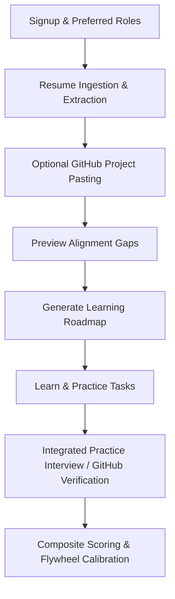

# SATA Career Intelligence Platform - Agent State

This document is the single source of truth for the active state of the SATA (Student Academic Tracking & Analytics) to Career Intelligence Platform pivot.

---

## 1. Active Core Workflow (Restructured & Non-Blocking)

The platform onboarding sequence has been restructured to avoid forcing new users into a live WebSocket interview immediately. Instead, validation is integrated naturally inside the learning roadmap:



### Path Components & Onboarding Step Sequence
1. **Account Registration**: User signs up and inputs target roles/availability, establishing `onboarding_step = 'preferred_role_set'`.
2. **Resume Scan & Extraction**: PDF Upload is parsed using `/api/interview/sessions/parse-resume`. Technical skills are then extracted via `POST /api/skills/extract-resume-skills` with target roles biasing, upserting `student_skills` with `resume_weight = 70.0`, and advancing state to `resume_uploaded`.
3. **Connect GitHub (Optional)**: Pasted public repo URLs are queued asynchronously via `/api/skills/project/verify`, advancing state to `github_added`.
4. **Gap Preview & Roadmap**: The computed gaps are shown (`gap_analysis_shown`). The user triggers `generateRoadmap` which creates personalized nodes. The onboarding status is set to `complete`, and the student is shown the dashboard.
5. **Practice Interviews**: Technical screens are integrated as `task_type = 'practice'` interview tasks under prioritized skill nodes. Launching one dynamically initializes a specialized, skill-focused 3-question WebSocket technical screen.
6. **Apply Project Nodes & Depth Verification**: Student pushes projects to GitHub. Submitting validation URL triggers async analysis and updates `validation_status` to `'verified'`. Completed and structurally-verified projects expose a **Verify this project further** action button. This launches a project-based depth-verification interview grounded in the repository context. Completing this successfully updates `depth_verified = True` and calibrates matching skills.
7. **Score Calibration & Feedback Loop**: Upon completing micro-sessions or projects, weights are recalculated and the match score dynamically shifts.
8. **Topic-Based Practice Interviews (Direct Path)**: The student can select a skill/topic directly from the taxonomy. This initializes a 3-question skill-focused micro-interview. On completion, it calibrates the skill's weights, updates the source array to include `'interview'`, and dynamically satisfies the gating requirement for any sibling practice task tied to the same skill in their active roadmap.

---

## 2. Database State (Active PostgreSQL Tables)

### User & Core Models
#### `users`
- `id` (UUID, PK)
- `student_id` (String(50), Unique, Indexed, Nullable)
- `email` (String(255), Unique, Indexed, Nullable=False)
- `password_hash` (String(255), Nullable=False)
- `is_active` (Boolean, Default=True)
- `role` (Enum: student, admin, faculty, Default=student)
- `failed_login_attempts` (Integer, Default=0)
- `locked_until` (DateTime, Nullable=True)
- `created_at` (DateTime, timezone=True)
- `updated_at` (DateTime, timezone=True)

#### `student_profiles`
- `id` (UUID, PK)
- `user_id` (UUID, FK `users.id`, Unique, Nullable=False)
- `name` (String(255), Nullable=False)
- `department` (String(255), Nullable=False)
- `semester` (Integer, Nullable=False)
- `interests` (Text, Nullable=True)
- `cgpa_10scale` (Numeric(4, 2), Nullable=True)
- `batch_year` (Integer, Nullable=True)
- `performance_status` (String(20), Nullable=True)
- `backlog_count` (Integer, Default=0)
- `active_backlog` (Boolean, Default=False)
- `cgpa` (Numeric(4, 2), Nullable=True)
- `created_at` (DateTime, timezone=True)
- `updated_at` (DateTime, timezone=True)

#### `academic_terms` [DELETED]
- Tablename dropped. No longer exists in the schema.

#### `subjects` [DELETED]
- Tablename dropped. No longer exists in the schema.

### Career & Skill Models
#### `skill_taxonomy`
- `id` (UUID, PK)
- `skill_name` (String(100), Unique, Nullable=False)
- `category` (String(50), Nullable=False)
- `aliases` (ARRAY(Text))
- `description` (Text)
- `skill_type` (String(20), Default='concept')
- `parent_id` (UUID, FK `skill_taxonomy.id`, Nullable=True)
- `created_at` (DateTime)

#### `student_projects`
- `id` (UUID, PK)
- `user_id` (UUID, FK `users.id`, Nullable=False)
- `title` (String(255), Nullable=False)
- `description` (Text)
- `tech_stack` (ARRAY(Text))
- `domain` (String(100))
- `complexity` (String(20))
- `project_url` (String(500))
- `completed_at` (Date)
- `repo_url` (String(255), Nullable=True, GitHub Domain validated)
- `extracted_skills` (JSONB, Nullable=True)
- `calculated_complexity` (Integer, Nullable=True)
- `analyzed_at` (DateTime, Nullable=True)
- `depth_verified` (Boolean, Default=False, Nullable=False)
- `depth_verified_at` (DateTime, Nullable=True)

#### `student_preferences`
- `id` (UUID, PK)
- `user_id` (UUID, FK `users.id`, Unique, Nullable=False)
- `target_roles` (ARRAY(String))
- `preferred_domains` (ARRAY(String))
- `open_to_remote` (Boolean, Default=True)
- `career_transition` (Boolean, Default=False)
- `transition_from` (String(100))
- `transition_to` (String(100))
- `timeline_months` (Integer)
- `experience_level` (String(20))
- `available_hours_per_week` (Integer, Nullable=True)
- `onboarding_step` (String(50), Default="preferred_role_set", Nullable=False)

#### `student_skills`
- `id` (UUID, PK)
- `user_id` (UUID, FK `users.id`, Nullable=False)
- `skill_id` (UUID, FK `skill_taxonomy.id`, Nullable=False)
- `confidence_score` (Numeric(5, 2), Default=0)
- `level` (String(20))
- `source` (ARRAY(Text))
- `resume_weight` (Numeric(5, 2), Default=0)
- `project_weight` (Numeric(5, 2), Default=0)
- `interview_weight` (Numeric(5, 2), Default=0)
- `communication_weight` (Numeric(5, 2), Default=0)
- `is_interview_scored` (Boolean, Default=False, Nullable=False)
- `last_computed_at` (DateTime)

#### `job_skill_requirements`
- `id` (UUID, PK)
- `job_role` (String(255), Nullable=False)
- `skill_id` (UUID, FK `skill_taxonomy.id`, Nullable=False)
- `importance` (String(20), Nullable=False)
- `min_score_required` (Numeric(5, 2))

#### `skill_gaps`
- `id` (UUID, PK)
- `user_id` (UUID, FK `users.id`, Nullable=False)
- `job_role` (String(255), Nullable=False)
- `match_score` (Numeric(5, 2))
- `missing_skills` (JSONB)
- `weak_skills` (JSONB)
- `strong_skills` (JSONB)
- `high_potential_skills` (JSONB)
- `computed_at` (DateTime)

#### `roadmaps` & `roadmap_tasks`
- `roadmaps`: `id`, `user_id`, `job_role`, `version`, `status`, `is_transition`, `generated_by`, `total_tasks`, `completed_tasks`
- `roadmap_tasks`: `id`, `roadmap_id`, `skill_id`, `associated_skill_id`, `phase`, `task_type`, `title`, `description`, `resource_url`, `platform`, `estimated_hours`, `order_index`, `status`, `completed_at`, `feedback_score`, `submission_link`, `validation_status`, `resource_source`, `learning_resource_id`

#### `learning_resources`
- `id` (UUID, PK)
- `skill_id` (UUID, FK `skill_taxonomy.id`, Nullable=False)
- `title` (String(255), Nullable=False)
- `resource_url` (String(500), Nullable=False)
- `platform` (String(100), Nullable=False)
- `phase` (String(20), Default='learn')
- `upvotes` (Integer, Default=0)
- `downvotes` (Integer, Default=0)
- `created_at` (DateTime)
- `updated_at` (DateTime)

#### `behavior_summary`
- `id` (UUID, PK)
- `user_id` (UUID, FK `users.id`, Unique, Nullable=False)
- `interviews_completed` (Integer, Default=0)
- `interviews_abandoned` (Integer, Default=0)
- `questions_answered` (Integer, Default=0)
- `roadmap_tasks_done` (Integer, Default=0)
- `login_streak_days` (Integer, Default=0)
- `last_active_at` (DateTime)
- `consistency_score` (Numeric(5, 2))
- `engagement_level` (String(20))

#### `interview_sessions`
- `id` (UUID, PK)
- `user_id` (UUID, FK `users.id`, Nullable=False)
- `branch` (String(100), Nullable=False)
- `topic` (String(100))
- `status` (String(20), Default='active')
- `is_micro` (Boolean, Default=False, Nullable=True)
- `associated_skill_id` (UUID, FK `skill_taxonomy.id`, Nullable=True)
- `roadmap_task_id` (UUID, FK `roadmap_tasks.id`, Nullable=True)
- `project_id` (UUID, FK `student_projects.id`, Nullable=True)
- `created_at` (DateTime)
- `updated_at` (DateTime)

#### `interview_questions`
- `id` (UUID, PK)
- `session_id` (UUID, FK `interview_sessions.id`, Nullable=False)
- `topic` (String(100), Nullable=False)
- `question` (Text, Nullable=False)
- `difficulty` (String(20), Default='medium')
- `source` (String(50))
- `follow_up` (Text)
- `user_answer` (Text)
- `ai_score` (SmallInteger)
- `ai_verdict` (String(20))
- `ai_feedback` (Text)
- `model_answer` (Text)
- `mistakes` (JSONB)
- `improvement` (Text)
- `evaluated_at` (DateTime)
- `created_at` (DateTime)

---

## 3. Internal Taxonomy

Parent-child skill structures from `engine.py` / `TOOL_TO_PARENT`:
- **Relational Databases**
  - PostgreSQL
  - SQL
- **Web Technology**
  - React
  - FastAPI
- **Cloud Computing**
  - Docker
  - AWS
  - Kubernetes
- **Computer Vision**
  - OpenCV
- **Deep Learning**
  - TensorFlow
- **Mobile Computing**
  - React Native

Categories of taxonomy:
1. `core_cs`: DSA, Operating Systems, DBMS, Computer Networks, Software Engineering, OOP, Discrete Mathematics, TOC, Compiler Design, COA.
2. `backend`: Python, Java, FastAPI, Django, Flask, Node.js, REST APIs, SQL, PostgreSQL, MongoDB, Redis, GraphQL.
3. `frontend`: React, HTML, CSS, JavaScript, TypeScript, Tailwind CSS, Vue.js, Angular.
4. `ml`: Machine Learning, Deep Learning, NLP, Computer Vision, pandas, scikit-learn, TensorFlow, PyTorch, Data Analysis, Feature Engineering.
5. `cloud_devops`: Docker, Kubernetes, AWS, Git, Linux, CI/CD, Terraform, System Design.
6. `embedded`: C Programming, C++, Microcontrollers, VLSI Design, Embedded C, Arduino, RTOS, PCB Design.
7. `domain_ece`: Circuit Theory, Signals and Systems, Digital Electronics, Analog Electronics, Communication Systems, Power Systems.
8. `domain_mech`: Thermodynamics, Fluid Mechanics, Strength of Materials, Manufacturing Processes, CAD Design, Heat Transfer.

---

## 4. Completed Changes

### [2026-05-23]
- **State Document Initialization**: Created `.sata_agent_state.md` to establish the living state of the migration from academic tracking to B.Tech Career Intelligence.
- **Academic Tracking Purge & Refactoring Complete**:
  - Dropped PostgreSQL tables `academic_terms` and `subjects` via Alembic migrations.
  - Refactored `SkillTaxonomy` model for self-referential parent/child tree (`parent_id`) and enum `skill_type` constrained to `('concept', 'tool')`.
  - Refactored `StudentSkill` table: renamed `academic_weight` to `resume_weight`, removed `behavior_weight`, and verified composite confidence scoring integration.
  - Purged all routes, schemas, and import references to legacy academic terms, GPA, and subject templates across the entire codebase.
  - Verified 100% of unit and integration test suite passing successfully (31/31 tests).
  - Cleaned and ran database integrity checkers on Windows successfully.
- **WebSocket Technical Screen Implementation**:
  - Implemented full-duplex WebSocket router `@router.websocket("/ws/interview/{session_id}")` with token-based query and cookie authentication supporting robust enclosing quotes cleanup.
  - Implemented anti-plagiarism technical question generation utilizing Groq (`llama-3.1-8b-instant`) with `stream=True` to stream code-level debug trap questions in real-time over the WebSocket.
  - Implemented question-by-question response evaluation via Gemini (defaulting to Gemini 2.5 Flash, configurable via Settings) to score technical and communication metrics in real-time.
  - Implemented bi-directional skill calibration (+10/-10 on `interview_weight`, update `communication_weight`) and recalculation of composite student `confidence_score` and `level` on database state instantly.
  - Modified the WebSocket database session to use `Depends(get_db)` to support testing with SQLite in-memory overrides.
  - Added a dialect-safe fallback for `SkillTaxonomy` in-memory SQLite querying since SQLite lacks PostgreSQL's `array_to_string`.
  - Created and ran a robust WebSocket test suite (`tests/test_api_interview.py`) covering connection authorization, streaming, and mocked evaluations, with 100% of the backend tests (35/35) passing.
- **GitHub Ingestion Pipeline foundation**:
  - Extended `StudentProject` model (`app/models/student_project.py`) with integration fields (`repo_url`, `extracted_skills`, `calculated_complexity`, `analyzed_at`).
  - Added Python-level validates decorator on `StudentProject.repo_url` ensuring only `github.com` domain structures are accepted.
  - Fixed a legacy `academic_weight` attribute bug in `remove_manual_skill` inside `app/modules/skills/service.py` to use the correct `resume_weight` column.
  - Implemented the complete asynchronous complexity scoring pipeline `verify_github_complexity_async` inside `app/modules/skills/project_service.py`, using `httpx.AsyncClient` to query GitHub metadata, commits, contents, and readme endpoints.
  - Configured dialect-safe saving of `tech_stack` inside `project_service.py` (bypassing list binds on SQLite engines) to ensure 100% test compatibility.
  - Implemented `POST /api/skills/project/verify` endpoint inside `app/api/routes/projects.py` utilizing standard `Depends(get_db)` testing compliance, cookie auth, and non-blocking native `BackgroundTasks`.
  - Registered the projects router inside `app/main.py`.
  - Created and verified a dedicated unit and integration test suite (`tests/test_api_projects.py`), with all 40 tests passing perfectly.
- **GitHub Ingestion Weights Synchronization & Composite Calibration (Option 1 Complete)**:
  - Implemented the dynamic composite calibration loop and skill weights synchronization in `verify_github_complexity_async` inside `app/modules/skills/project_service.py`.
  - Configured dialect-safe `SkillTaxonomy` lookup (case-insensitive/aliases matching) across both PostgreSQL and SQLite.
  - Initialized or updated `StudentSkill` table rows dynamically with standard UUID primary keys and `"project"` added to `source` array.
  - Implemented Phase 4 linear combination composite `confidence_score` calculation: `(resume_weight * 0.2) + (project_weight * 0.4) + (interview_weight * 0.4)`.
  - Added full test coverage in `backend/tests/test_api_projects.py` covering both cold-start seeding and existing weight-recalibration math.
- **Career Recommendation Match Tiers & Frontend Overhaul (Option 2 Complete)**:
  - Refactored `SkillGap` database schema mapping JSONB structures for four isolated lists (`strong_skills`, `high_potential_skills`, `weak_skills`, and `missing_skills`).
  - Implemented the dynamic multi-tiered matched categorization in `engine.py` using matched score thresholds for Excellent, Good, Potential, and Low match categories.
  - Added full parental conceptual enrichment (identifying children with parent concept knowledge and enriching `parent_id` to `parent_name`).
  - Created a robust API route `GET /api/skills/recommendations` protecting connection using HTTP-only cookie authentication and returning matched recommendations.
  - Registered the career router inside `app/main.py`.
  - Added robust integration test suite `tests/test_api_career.py` with 100% test coverage (43/43 tests passing green).
  - Implemented SQLite dialect-safe shims for UUID query parameters and string target roles parsing fallback.
  - Refactored frontend `GapCard` to use a dynamic, score-based capability match alert badge (`MatchBadge`) and purple-themed **Potential Bridging Opportunities** categories.
  - Displayed the custom foundational verification instructions (*"⚡ Foundation Verified: You possess the theoretical baseline for these tools. Click 'Generate Roadmap' to quickly master the syntax."*) inside the expanded card view, listing parent concept taxonomy connections dynamically.
  - Optimized dashboard performance by sharing the `['career-recommendations']` query key and setting up query cache invalidation on manual skill adjustments.
  - **Roadmap Multi-Modal Completion & Link Ingestion (Option 3 Complete)**:
    - Refactored `RoadmapTask` database model with new fields (`associated_skill_id`, `submission_link`, `validation_status`) and check constraints enforcing `'learn'`, `'practice'`, and `'apply'` task types.
    - Updated Pydantic schemas in `schemas.py` to expose these new task properties.
    - Refactored the `POST /api/roadmap/tasks/{task_id}/complete` (and plural `/api/roadmaps/...`) endpoint to be asynchronous.
    - Enabled support for `'apply'` phase tasks by accepting an optional `submission_link` payload, setting `validation_status = 'pending'`, and queuing it via `verify_github_complexity_async` background task.
    - Modified the Option 1 GitHub Ingestion Pipeline to support updating the associated `RoadmapTask`'s `validation_status` to `'verified'` or `'failed'` and `status` to `'completed'` upon validation success, triggering proper skill calibration weights updates.
    - Added a comprehensive integration test suite `tests/test_api_roadmaps.py` passing 100% green.
  - **Closed-Loop Micro-Interview Verification (Option 3 Dynamic Interview Complete)**:
    - Created specialized session initializer `create_micro_interview_session(user_id, skill_id, db)` in `InterviewService` (`app/modules/interview/service.py`) returning a 3-question micro-interview session focused explicitly on the target skill.
    - Embedded advanced technical prompting inside the initializer to bypass general icebreakers and immediately stream code-review or troubleshooting puzzles tailored to the specific skill.
    - Implemented 3-Tier Fallback question generation (Groq -> Gemini -> Static fallback) to ensure session initialization is robust under high traffic or API limits.
    - Integrated WebSocket evaluation check `evaluate_single_answer_async` to verify if the session is a `micro_interview` upon completion.
    - Programmed automatic verification logic: if the average session score is `>= 7.0`, automatically mark the corresponding `RoadmapTask` status as `"completed"` and `validation_status = 'verified'`, increment completed tasks on the parent `Roadmap`, and trigger composite skill score calibration (+10 on `interview_weight`).
    - Added comprehensive integration tests in `tests/test_micro_interviews.py` covering session generation, successful passing verification, and failure handling, all passing perfectly.
  - **Frontend Closed-Loop & Gamification Complete**:
    - Refactored `frontend/src/pages/RoadmapPage.tsx` to handle dynamic interaction flows based on `task_type`:
      - **Learn / Practice Nodes**: Clicking complete pops up a custom modal asking *"Ready to lock in your progress? Take a 3-minute quick screen to officially unlock this skill badge."* with a button that creates a micro-session and seamlessly redirects to `/interview?session_id={session_id}&websocket=true`.
      - **Apply Nodes**: Replaced checkboxes with an input field requesting a GitHub repository URL. Re-enabled submission validation ensuring only `github.com` structures are accepted.
      - **Pending State & Real-Time Polling**: Displayed a `"⚙️ Analysis Pending"` spinner and badge while `validation_status === 'pending'`. Programmed efficient Reactive short-polling (every 3 seconds) using React Query's `refetchInterval` that only triggers when pending tasks exist.
      - **Green Toast Notification**: Tracked status changes to flash a premium green toast notification: `"🎉 Project Verified! Your project weight has been upgraded!"` upon successful project analysis.
    - Updated `frontend/src/pages/InterviewPrep.tsx` to mount the fully event-driven, real-time `WebSocketInterviewRoom` component matching premium visual design guidelines (featuring countdown timers, voice recording stream, live typewriter text, real-time score evaluations, and completed session sync).
    - Enabled `ws: true` in standard Vite `/api` proxy inside `frontend/vite.config.ts` to allow local development environment WebSocket connections to cleanly forward HttpOnly authentication credentials.

### [2026-07-02]
- **Real-Time WebSocket AI Interviewer Streaming**:
  - Refactored Gemini questions generator in `backend/app/modules/interview/service.py` to stream content line-by-line using `streamGenerateContent?alt=sse` and `httpx.AsyncClient.stream` when `on_chunk` callback is provided.
  - Implemented `question_complete` WebSocket event in `backend/app/modules/interview/router.py` containing the generated questions dataset to provide a terminal boundary marker.
  - Created a custom `useWebSocketInterview` React hook inside `frontend/src/hooks/useWebSocketInterview.ts` to manage all WebSocket connection state parameters and stream text buffering efficiently.
  - Replaced native WebSocket hook setup inside `frontend/src/pages/InterviewPrep.tsx` component `WebSocketInterviewRoom` with the new custom hook.
  - Updated the loading screen in the interview prep page to display a beautiful green programmer-style terminal log that lists streamed question fragments in real-time.
  - Refactored WebSocket chunk delivery in `backend/app/modules/interview/router.py` to stream tokens directly as raw plain-text frames via `send_text()` instead of wrapping them in structured JSON frames via `send_json()`, bypassing JSON overhead and serialization latency.
  - Updated the `useWebSocketInterview` React hook to dynamically identify and parse control events (using braces heuristic `{...}`) vs raw plain-text streaming tokens to maintain a sub-second response live stream.
  - Verified no global response compression or `GZipMiddleware` is active in `backend/app/main.py` that would buffer stream responses.
  - Added a pulsing terminal block cursor (`live-caret` with keyframe-blink) at the end of the streaming console text block.
  - Refactored `MicButton` to render an absolute `bg-red-500 animate-ping` backdrop ring when recording, and added dynamic pulse glowing to the inner square stop icon.
  - Upgraded the static speech caption container to a flexible answer input panel using a `<textarea>` synced with voice transcription, allowing seamless text typing and speech recording.
  - Implemented real-time interim voice streaming feedback in the textarea's placeholder during speech capture.
  - Added an explicit `isStreamingActive` safety block to disable the "Skip" and "Lock In Answer" buttons during active incoming stream chunks to eliminate potential race conditions.
  - Implemented continuous, hands-free "Google Assistant" style live loop option:
    - Extended the `useTTS` speech engine hook in `frontend/src/pages/InterviewPrep.tsx` to support callbacks triggered on speech completion (`onend`).
    - Configured the typewriter/TTS effect to automatically start voice listening mode as soon as the question finishes reading aloud.
    - Added a silence-detection `useEffect` that automatically submits the user's transcript to the WebSocket server after `2.2` seconds of speech pause, advancing the interview continuously.
    - Embedded a premium `🤖 Assistant Mode (Hands-Free)` togglable switch badge in the Top Bar so users can easily toggle between hands-free assistant mode and manual control.
  - Fixed Lobby page entry point: Programmed `createMutation.onSuccess` to explicitly invoke `setIsWebSocketMode(true)`, ensuring all interviews launched directly from the setup page lobby default to the live WebSocket streaming room.
  - **Dynamic, Conversational Follow-Up Loop & Frontend Unification**:
    - Created `generate_next_question_async` in `backend/app/modules/interview/service.py` to prompt Gemini/Groq dynamically based on the conversation history (previous questions, answers, and evaluations), tailoring the next question to probe deeper or target skill gaps.
    - Updated `start_interview` event in `backend/app/modules/interview/router.py` to generate only 1 question initially (`limit=1`), and refactored `submit_answer` event to dynamically generate the next question on-the-fly until the session limit is reached.
    - Replaced the legacy conditional HTTP-based `InterviewRoom` view with a unified real-time `WebSocketInterviewRoom` in `frontend/src/pages/InterviewPrep.tsx` for all active interview states, removing redundant states and spinners.
    - Added a dynamic follow-up drafting terminal console overlay (*"Drafting follow-up question..."*) inside the question card, streaming raw question tokens in real-time before typewriting them.

### [2026-07-05]
- **API Model Configurable Migration & Scope Issue Resolution**:
  - Reverted hardcoded API keys in `app/core/config.py` to prevent credentials from being committed to Git or publicly exposed.
  - Placed raw `GROQ_API_KEY`, `GEMINI_API_KEY`, and `RAPIDAPI_KEY` credentials in the local gitignored `.env` file.
  - Added `GEMINI_MODEL` to `Settings` (defaulting to `"gemini-2.5-flash"`) to support newer model versions dynamically based on user key constraints.
  - Refactored model names in `roadmap/service.py`, `skills/project_service.py`, and `interview/service.py` to reference `settings.GEMINI_MODEL`.
  - Resolved `UnboundLocalError: cannot access local variable 'json'` within the `generate_questions_async` method of `InterviewService` by removing the redundant local `import json` statement that shadowed the global import.
  - Verified stability with all 54 unit and integration tests passing successfully.
- **Question Formatting & Code Snippet Rendering**:
  - Appended a strict instruction to system prompts in `generate_questions_async`, `generate_next_question_async`, and `create_micro_interview_session` in `backend/app/modules/interview/service.py` to explicitly write out code/query snippets in standard markdown blocks inside the question string.
  - Implemented `renderQuestionText` component helper in `frontend/src/pages/InterviewPrep.tsx` to dynamically split streamed question text by markdown code blocks and render snippets inside a custom preformatted, console-style editor view.
- **Curated Learning Resources & Vote Feedback Loop**:
  - Implemented the new `learning_resources` table database model to store curated links, and expanded the `roadmap_tasks` model to support `resource_source` and `learning_resource_id` tracking.
  - Aligned database migration history by stamping the head version manually and generated/applied the new migration `4f15d3899166_add_learning_resources`.
  - Created a Python seeding script `backend/scripts/seed_learning_resources.py` populating 30 known-good documentation and interactive reference tutorial links for core skills like React, FastAPI, SQL, Git, and Python.
  - Refactored backend service retrieval `get_resources_for_skill` to load curated resources first, falling back to LLM suggestions only if unavailable.
  - Created endpoint `POST /api/roadmap/tasks/{task_id}/vote` that records upvotes/downvotes, and automatically promotes dynamic AI links to the curated library when upvoted.
  - Expanded frontend typescript definitions in `frontend/src/types/career.ts` and updated `RoadmapPage.tsx` columns to show visual Curated/AI badges and thumbs-up/down voting interactions.
  - Added new integration test `test_vote_on_resource_endpoint` to verify voting and link promotion logic, and successfully executed the pytest test suite with all 55/55 tests passing.

### [2026-07-08]
- **Roadmap Task Phase Ordering Constraint Enforcement**:
  - Implemented a dialect-safe validation check in the `POST /api/roadmap/tasks/{task_id}/complete` (and `/api/roadmaps/...`) endpoint in `backend/app/modules/roadmap/router.py`.
  - The check ensures that a student cannot start or complete an `apply` phase task if there are incomplete (status is not `'completed'`) sibling `learn` or `practice` phase tasks with the same `associated_skill_id` under the same roadmap, returning `HTTP 409 Conflict`.
  - Modified existing integration tests in `backend/tests/test_api_roadmaps.py` to set sibling `learn` tasks as `'completed'` to satisfy the new constraints.
  - Added new integration tests verifying:
    - Attempting to complete an `apply` task with incomplete prerequisites fails with `409 Conflict`.
    - Completing an `apply` task after all prerequisites are completed succeeds.
    - Completing an `apply` task for a skill with no `learn`/`practice` sibling tasks does not block and succeeds.
  - Ran all tests using pytest and verified that all 12 tests pass successfully.
- **Career Match Scoring Engine Transparency (Breakdown Endpoint)**:
  - Refactored core scoring loop from `compute_gaps_for_student` into a reusable helper function `calculate_role_score_and_breakdown` in `backend/app/modules/skills/engine.py` to ensure zero code duplication.
  - Added the endpoint `GET /api/skills/recommendations/{job_role}/breakdown` in `backend/app/api/routes/career.py` returning detailed match contribution breakdown for a job role.
  - Implemented `distance_to_next_tier` returning the next category, points needed, and top 2-3 highest leverage skills (sorted by weight and name).
  - Configured `distance_to_next_tier` to return `null` if the match is already in the top "Excellent Match" tier.
  - Added new integration tests in `backend/tests/test_api_career.py` verifying the breakdown and distance parameters across all match tiers (Excellent/Good/Potential/Low) and 404 responses for nonexistent roles.
  - Verified all 15 tests pass successfully.
- **Roadmap Generation Time-Realistic Pacing**:
  - Added `available_hours_per_week` column to `student_preferences` model and applied Alembic migration `5a5c9e2b1156`.
  - Updated Pydantic schemas in `backend/app/modules/preferences/schemas.py` and service maps.
  - Configured `get_roadmap` in `backend/app/modules/roadmap/service.py` to calculate `projected_completion_weeks` and `pacing_status` (`"on_track"` vs `"behind"`) using available hours and `BehaviorSummary` activity records.
  - Expanded frontend typescript definitions in `frontend/src/types/career.ts` and added an available hours input select to the Step 2 onboarding form in `Register.tsx`.
  - Added integration tests verifying pacing status responses with/without available hours.
- **Job Requirements Review Staleness Transparency**:
  - Added `last_reviewed_at` column to `job_skill_requirements` model and applied Alembic migration `2b3c4d5e6f7a` backfilling with default date `2026-03-01`.
  - Updated skills recommendation endpoints to resolve the oldest reviewed date among requirement rows for each role.
  - Surfaces the reviewed date on the frontend dashboard primary banner and individual cards in `SkillsPage.tsx`.
  - Added integration tests confirming the oldest review date resolves correctly in recommendations payload.
  - Ran all 17 tests using pytest with all tests passing.
- **Scoring & Limitations Disclosure Patterns**:
  - Created a reusable `<Disclosure />` component in `frontend/src/components/common/Disclosure.tsx` with dedicated copy for GitHub verification, career match scoring, and system limitations.
  - Replaced the hardcoded verified toast messages and badges in `RoadmapPage.tsx` with disclosures noting that GitHub project validations are heuristic pre-filters (checking tests, CI config, README, commit history) rather than correctness reviews.
  - Added an expandable "How is this calculated?" disclosure pattern to the career match dashboard card in `SkillsPage.tsx` outlining the weights and thresholds logic.
  - Added a "Known Limitations" disclosure card to the Settings page in `Settings.tsx` covering GitHub heuristic limits, AI interview calibration context, and job requirements revision frequency.
- **Onboarding Wizard Restructure & Non-Blocking Sequence**:
  - Restructured onboarding to defer the live WebSocket screen, wrapping it instead as practice tasks inside learning roadmaps.
  - Implemented `POST /api/skills/extract-resume-skills` endpoint parsing resumes via Gemini, biasing by target roles and mapping dialect-safely.
  - Formulated the proportional composite scoring fallback:
    $$\text{Confidence Score} = \frac{\text{resume\_weight} \times 0.2 + \text{project\_weight} \times 0.4}{0.6}$$
  - Exposes `onboarding_step` and `is_interview_scored` schema fields.
  - Created a beautiful glassmorphism React onboarding overlay `OnboardingWizard.tsx` in the frontend dashboard.
  - Added new integration tests validating fallback math and endpoints.

### [2026-07-09]
- **DB-Backed Interview Skill Profiles & Settings Resume Re-Upload**:
  - Removed raw `resume_context` parameter from `SessionCreateRequest` schema in `backend/app/schemas/interview.py`.
  - Modified `create_session` and WebSocket `/ws/interview/{session_id}` in `backend/app/modules/interview/router.py` to query the student's `student_skills` from the DB and pass the formatted skill profile to `generate_questions_async` at session-start time.
  - Refactored `generate_questions_async` in `backend/app/modules/interview/service.py` to format and inject the student's skill profile dynamically into the prompt.
  - Updated the onboarding resume extraction route `extract_resume_skills` in `backend/app/modules/skills/router.py` to support resume re-uploads: upserting new/existing skills with `resume_weight = 70.0`, and zeroing out the `resume_weight` of previously resume-sourced skills that no longer appear (preserving their project/interview weights and recalculating composite scores).
  - Overhauled the frontend: removed the resume input card from the Interview Prep Lobby in `frontend/src/pages/InterviewPrep.tsx`, updated the API helpers, and added a premium **Resume Profile** card in `frontend/src/pages/Settings.tsx` to handle PDF resume uploads and skills re-extraction.
  - Created a robust pytest test suite `backend/tests/test_resume_reupload.py` verifying session start database reads and resume re-upload weight resets, with all tests passing successfully.
- **Topic-Based Practice Interviews**:
  - Added `PracticeTopicCreateRequest` schema in `backend/app/schemas/interview.py`.
  - Added `GET /api/skills/topics` endpoint in `backend/app/modules/skills/router.py` to return the complete practiceable topics list from taxonomy.
  - Refactored interview context generation into a shared utility method `build_skill_practice_context` inside `backend/app/modules/interview/service.py`.
  - Implemented the `POST /api/interview/sessions/practice-topic` endpoint in `backend/app/modules/interview/router.py` initializing a skill-focused micro-interview session from the taxonomy without JDs or roadmap tasks.
  - Updated calibration logic in `evaluate_single_answer_async` to append `"interview"` to the skill's source list dynamically, and auto-complete corresponding practice roadmap tasks if they are active when the session completes with score >= 7.0.
  - Updated phase gating in `backend/app/modules/roadmap/router.py` task completion to satisfy practice phase requirements if there is any completed interview session covering that skill, preventing duplicate screens.
  - Created a robust pytest test suite `backend/tests/test_practice_topics.py` verifying all practice topic paths, gating bypasses, and calibration hooks.
- **Project-Based Depth-Verification Interviews**:
  - Added database columns `depth_verified` (Boolean, default False) and `depth_verified_at` (DateTime, nullable) to `student_projects`.
  - Added database column `project_id` (UUID, Foreign Key) to `interview_sessions` to link interview sessions directly to github project records.
  - Created and ran Alembic database migration schema update `353ba9408210_add_depth_verified_to_projects`.
  - Added `PracticeProjectCreateRequest` schema in `backend/app/schemas/interview.py`.
  - Implemented `POST /api/interview/sessions/practice-project` endpoint in `backend/app/modules/interview/router.py`.
  - Added `create_practice_project_session` helper method in `backend/app/modules/interview/service.py` to query GitHub API dynamically to fetch README context and file folders, prompting Gemini/Groq with contextualized implementation questions.
  - Updated completion hook in `evaluate_single_answer_async` to set `depth_verified = True` and `depth_verified_at` on completion, and calibrate `interview_weight` for all skills associated with that project.
  - Updated frontend `types/career.ts` and `services/api.ts` to support `createProjectSession` and project-based properties.
  - Modified frontend `pages/RoadmapPage.tsx` to render distinct "Structurally Verified" and "Depth Verified" badges on project task cards, and added the "Verify this project further" button with loading/error handling.
  - Created a robust pytest test suite `backend/tests/test_project_depth_interviews.py` verifying context retrieval, database updates, calibration hooks, and status independent representation.

### [2026-07-10]
- **Frontend Syntax & Type Mismatch Fixes**: Resolved critical compilation issues in `frontend/src/pages/InterviewPrep.tsx` where the `Lobby` function declaration was commented out and an extra trailing brace pair was present.
- **Direct Topic Practice Integration**: Integrated the frontend selection workflow for topic-based practice interviews. Added a tabbed UI view in the Setup panel to toggle between a custom Job Description or direct taxonomy skill practice. Added a searchable skills grid matching the workspace theme and connected all query/mutation handlers to the backend topics and practice endpoints.
- **Custom Practice Prompt Integration**: Configured the backend service to load the custom topic-based practice prompt for question generation and dynamic evaluations when conducting direct topic practice rounds. Calibrates question scope and feedback context dynamically using user skill levels.
- **Project Practice Prompt & Verification Threshold**: Configured custom project deep-dive prompts for project practice sessions grounded in README, file structure, and skills. Implemented threshold evaluation logic (`overall_score >= 6 and depth_verified_recommendation is True`) to determine project depth verification dynamically. Added integration tests covering all threshold check scenarios.

### [2026-08-04]
- **Removed Demo Credentials from Login Page**: Deleted the hardcoded `Demo Credentials` UI block (User ID: S00001 / Password: S00001@123) from `frontend/src/pages/Login.tsx` to eliminate exposed test credentials from the production UI; the placeholder text on the Student ID input field was preserved.
- **Full Docker Containerization & Railway Deployment Setup**: Added `backend/Dockerfile` (multi-stage, non-root uid 1001, `entrypoint.sh` waits for Postgres then runs `alembic upgrade head` before starting Uvicorn), `backend/entrypoint.sh`, `backend/.dockerignore`, upgraded `backend/Dockerfile.ml` to multi-stage with non-root user, fixed `ML_SERVICE_URL` default from `localhost:8001` to `http://ml_service:8001` in `app/core/config.py`, added `frontend/Dockerfile` (node:20-alpine build → nginx:1.27-alpine runtime, ~30MB), `frontend/nginx.conf` (REST + WebSocket reverse proxy to `backend:8000`, SPA fallback, security headers, 16MB upload limit), `frontend/.dockerignore`, updated `frontend/vite.config.ts` proxy target to `VITE_BACKEND_URL || http://backend:8000`, completely rewrote `docker-compose.yml` adding the missing `backend` and `frontend` services with correct `DATABASE_URL` override (Docker service name), internal-only `ml_service` (no exposed port), `uploads_data` volume for resume persistence, and `depends_on: postgres: condition: service_healthy`, created root-level `.env.example` with full documentation, updated `.gitignore` with Docker/Railway/log ignores, and added `railway.json` — the goal was to make `docker compose up --build` start the entire stack with zero manual setup and prepare all three services (frontend, backend, ml_service) for one-click Railway deployment using Dockerfile builder.

### [2026-08-05]
- **WebSocket Reconnect State Machine for Interview Sessions**: Rewrote `frontend/src/hooks/useWebSocketInterview.ts` to implement a 6-state connection machine (`idle → connecting → connected ↔ reconnecting → failed / closed`) with exponential backoff + jitter (7-retry budget, 1s–15s range), a cold-start-aware 75s first-connect timeout (server can take ~60s to wake from idle), and 6-minute keep-alive pings mapped to a new `ping → pong` handler in `backend/app/modules/interview/router.py`. Auth and session-not-found error paths in `router.py` now emit close codes `4001`/`4004` instead of the default `1000`, enabling non-retryable short-circuit on the frontend. Added `frontend/src/components/interview/WsConnectionBanner.tsx` (state-aware banner: indigo for cold-start waking, amber with attempt counter for reconnecting, red with action buttons for terminal failures) and `frontend/src/components/interview/ReconnectToast.tsx` (green spring-animated toast on `reconnecting → connected`); both integrated into `WebSocketInterviewRoom` in `InterviewPrep.tsx`, replacing the old undifferentiated spinner. Key tradeoffs: (1) eval results lost to a socket drop are recovered via the existing `session_ready` payload — scores are committed to DB before the push attempt, so the reconnected socket's next payload already carries them — rather than introducing a server-side session-to-socket registry; (2) if the score is still null at reconnect (eval genuinely mid-flight), a single one-shot 18s delayed poll to `GET /api/interview/sessions/{id}` fires as a safety net — no loop — accepting a brief delay over an indefinitely stuck spinner; (3) a transitional `code === 1000 + no-prior-success` fallback branch handles auth-expiry detection before the backend close-code changes propagate, marked with a TODO for removal once `4001`/`4004` are confirmed live; (4) intentional closes (session complete, unmount) are tracked via `isIntentionalCloseRef` rather than relying on close codes alone to prevent false reconnect attempts after a normal session end.
- **ml_service Merged into Main Backend**: Eliminated the separate `ml_service` always-on container. Investigation confirmed `ML_SERVICE_URL` was dead config — the main backend's `generate_questions_async` already ran an in-process Groq → Gemini → static-bank fallback chain with no httpx calls to the sub-service. The production-hardened Groq client (JSON validation, near-duplicate dedup, rate-limit/timeout handling) was moved from `backend/ml_service/groq_client.py` to `backend/app/modules/interview/groq_client.py`. Removed: `backend/Dockerfile.ml`, `backend/ml_service/` source directory, `ml_service` service block and `backend.depends_on` reference from `docker-compose.yml`, `ML_SERVICE_URL` and `ML_SERVICE_TIMEOUT` from `backend/app/core/config.py`, and the ML sub-service section from both `.env.example` files. Tradeoffs: (1) losing process isolation is acceptable since the logic is a thin external-API wrapper, not a resource-heavy local model; (2) reduces deployable surface from 3 always-on services to 2, enabling a genuinely free Render tier; (3) independent scaling of ML fallback logic is no longer possible — acceptable at current traffic levels; (4) no change in fallback behavior or latency — the in-process chain was already functionally identical to the sub-service.

---

### [2026-08-18]
- **Railway → Render Migration + Neon as External Postgres**: Migrated deployment platform from Railway to Render (free tier) and database from Railway-managed Postgres to Neon (provisioned separately as an external serverless Postgres). Changes: added `render.yaml` Blueprint at repo root defining two Docker web services (`sata-backend`, `sata-frontend`) on the free plan; deleted `railway.json`; created `docs/deployment-render.md`. The Blueprint uses `sync: false` for secrets (`DATABASE_URL`, `CORS_ORIGINS`, `GROQ_API_KEY`, `GEMINI_API_KEY`, `RAPIDAPI_KEY`, `BACKEND_URL`) and `generateValue: true` for `SECRET_KEY`. Future env var changes go through the Render dashboard per-service Environment tab (or a Blueprint re-sync for non-secret values), replacing Railway's per-service Variables tab workflow.
- **Private Networking Tradeoff — nginx Upstream Target Changed**: Render's free tier has no private networking between services (unlike Railway's paid tier). The `upstream backend { server backend:8000; }` block in `frontend/nginx.conf` used the Docker Compose service name which does not resolve on Render. Fix: renamed `nginx.conf` → `nginx.conf.template` with `${BACKEND_URL}` as a literal placeholder in `proxy_pass` directives (replacing both the upstream block and `proxy_pass http://backend` references). The frontend `Dockerfile` now runs `envsubst '$BACKEND_URL' < nginx.conf.template > /tmp/nginx.conf && nginx -g 'daemon off;' -c /tmp/nginx.conf` at container startup, injecting the backend's public `https://sata-backend.onrender.com` URL. Added `proxy_ssl_server_name on` for SNI on HTTPS upstreams. Frontend→backend traffic now goes over the public internet via Render's HTTPS edge — accepted tradeoff for free-tier, not an oversight. Local Docker Compose is **unaffected** (uses `target: builder` for frontend, skips the nginx stage entirely).
- **`BACKEND_URL` Blueprint Limitation — `fromService.host` is Private Hostname**: Per the Render Blueprint spec, `fromService.property: host` resolves to the service's **private network hostname**, not the public URL. On the free tier with no private networking, this value is unreachable. Blueprint also does not support string interpolation (cannot prepend `https://`). Decision: `BACKEND_URL` is marked `sync: false` and must be pasted manually as `https://sata-backend.onrender.com` in the Render dashboard on first deploy. Documented in both `render.yaml` comments and `docs/deployment-render.md §3`.
- **`DATABASE_URL` Format — No Normalization Needed for Neon**: Neon connection strings already use `postgresql://` (matching `config.py`'s `validate_database_url` validator). The `entrypoint.sh` wait-for-Postgres TCP check works correctly with Neon's pooler endpoint (always reachable). No changes were required to `entrypoint.sh` or `config.py`. The `${PORT:-8000}` fallback works identically on Render (same `PORT` injection pattern as Railway).
- **`ML_SERVICE_URL`/`ML_SERVICE_TIMEOUT` Confirmed Absent**: Verified these vars are absent from both `.env.example` files and all env var docs. Only remaining references are source code comments noting the historical merge — no cleanup needed.


## 5. Architectural Coding Guidelines

### Testing & Database Compliance
- **Mandatory Dependency Injection**: All endpoints—including WebSocket connections (`@router.websocket`)—**MUST** utilize FastAPI's `Depends(get_db)` mechanism to retrieve database sessions.
- **Never instantiate `SessionLocal()` directly**: Direct instantiation of `SessionLocal()` inside route logic is strictly prohibited. It bypasses `app.dependency_overrides` and causes integration tests to fail because they cannot run against the isolated, in-memory SQLite database.
- **SQLite Dialect Compatibility**: Keep all database queries dialect-safe to support SQLite. Always inspect `db.bind.dialect.name` if using PostgreSQL-specific SQL functions (e.g. `array_to_string`) and provide safe Python-based fallback paths for SQLite testing.

---

## 6. GitHub Integration Pipeline (Option 1)

### Async REST API Query Layout
The background handler `verify_github_complexity_async` parses `repo_url` (extracting `owner` and `repo`) and executes the following sequence of asynchronous HTTP calls (using `httpx.AsyncClient` and `User-Agent: SATA-Career-Intelligence-Platform`):
1. `GET https://api.github.com/repos/{owner}/{repo}`: Verify base repository exists and extract description metadata.
2. `GET https://api.github.com/repos/{owner}/{repo}/commits`: Fetch the repository commit history entries.
3. `GET https://api.github.com/repos/{owner}/{repo}/contents`: Fetch root content tree of files and directories.
4. `GET https://api.github.com/repos/{owner}/{repo}/readme`: Fetch default README file information and base64-encoded file content.
5. `POST https://generativelanguage.googleapis.com/v1beta/models/{GEMINI_MODEL}:generateContent?key={key}`: Trigger Gemini skill tag extraction on decoded README text.

### Programmatic Complexity Scoring Heuristics (100 Points Max)
- **Base Repository Check (20 Points)**:
  - Add **+20 points** on successful `200 OK` from repository metadata endpoint.
- **Commit History Multiplier (20 Points)**:
  - **+20 points** if commit history has `> 30` entries.
  - **+10 points** if commit history has `10` to `30` entries.
  - **+5 points** if commit history has `< 10` entries.
- **Architectural Nodes Evaluation (40 Points)**:
  - DevOps/Workflow node scan: **+15 points** if `Dockerfile`, `docker-compose.yml`, or a `.github` folder are present in root.
  - Testing framework node scan: **+15 points** if `pytest.ini`, `conftest.py`, `jest.config.js`, or a `tests` directory are present in root.
  - Architecture boundary scan: **+10 points** if folders named `auth`, `middleware`, or `services` are present in root.
- **Documentation Volume (20 Points)**:
  - **+20 points** if base64-decoded README length is `> 2000` characters.
  - **+10 points** if base64-decoded README length is between `500` and `2000` characters.
  - **+0 points** otherwise.

### Gemini Skill Tag Extraction Prompt
- **System Role Prompt**:
  *"Act as an automated technology identifier. Read this project README. Return ONLY a plain JSON array of framework, tool, or database strings discovered (e.g., ['FastAPI', 'React', 'Docker']). Do not include explanatory text or markdown backticks."*
- **Response Format**: Rigid JSON array of plain strings (e.g., `["FastAPI", "React", "Docker"]`).

---

## 7. Career Match Tiers Gap Analysis Engine

### Relational Database Parent/Child Tree Walking Logic
To compute gaps for a student's targeted career path dynamically without relying on static hardcoded dictionaries, the gap analysis engine walks up and down the `SkillTaxonomy` self-referential tree structure:
1. **Child Tool Lookup:** For each required skill `sid` from `JobSkillRequirements`, the system first checks the user's `confidence_score` in the `StudentSkill` table. If the tool exists and its `confidence_score >= 70.0`, the tool is classified as a **Strong Skill**.
2. **Relational Parent Lookup:** If the child tool score is absent or below `70.0`, the engine executes a relational database query on the `SkillTaxonomy` table to look up the record matching `sid` and extract its `parent_id`.
3. **Parent Concept Validation:** The system then looks up the extracted `parent_id` in the user's `StudentSkill` records. If the student has this Parent Concept skill (e.g., 'Relational Databases') populated with `resume_weight > 0.0`, the tool is classified as a **High Potential Skill**, recognizing the student's solid theoretical computer science foundation.
4. **Weak or Missing Categorization:** If neither validation passes, the skill is checked:
   - If the student has a record for the child tool (with score $< 70.0$), it is categorized under **Weak Skills**.
   - If no record exists for the child tool, it is categorized under **Missing Skills**.

### Match Heuristic Credit Allocation Algorithm
The dynamic career match score calculations apply traditional importance weights (`must_have` = 3, `preferred` = 2, `nice_to_have` = 1) across the matching skill gaps checklist:
- **Strong Skills:** Earn **100%** weight credit towards the met total.
- **High Potential Skills:** Earn **40%** weight credit towards the met total (rewarding academic foundation).
- **Weak and Missing Skills:** Earn **0%** weight credit (giving zero numerator weight).
- **Match Score Formula:**
  $$\text{Match Score} = \left(\frac{\text{Sum of Met Weighted Credits}}{\text{Total Job Requirement Weights}}\right) \times 100$$
- **Category Thresholds:**
  - Excellent Match: Match Score $\ge 60.0\%$
  - Good Match: $35.0\% \le$ Match Score $< 60.0\%$
  - Potential Match: $20.0\% \le$ Match Score $< 35.0\%$
  - Low Match: Match Score $< 20.0\%$

---

## 8. Student Skill Confidence Score Formulas

To prevent newly added skills from being penalized prior to completing any interview screens, the confidence score calculation handles fallback weight redistribution:

### A. Prior to Interview Validation (`is_interview_scored` is False)
Redistributes the 0.4 interview weight proportionally across the resume weight (0.2) and project weight (0.4):
$$\text{Confidence Score} = \frac{\text{resume\_weight} \times 0.2 + \text{project\_weight} \times 0.4}{0.6}$$

### B. Post Interview Validation (`is_interview_scored` is True)
Uses the standard multi-variable balance formula:
$$\text{Confidence Score} = (\text{resume\_weight} \times 0.2) + (\text{project\_weight} \times 0.4) + (\text{interview\_weight} \times 0.4)$$

---

## 9. Deployment Fix: nginx 508 Loop Detected on `/api/*` Proxy (2026-08-20)

### Root Cause

`frontend/nginx.conf.template` used `proxy_set_header Host $host;` in both the `/api/` and `/api/ws/` location blocks. On Render's infrastructure, the frontend container receives requests with `Host: sata-frontend.onrender.com`. With `$host`, nginx forwarded that same frontend hostname to the backend upstream (`https://sata-backend-n1k5.onrender.com`). Render's edge router sees `Host: sata-frontend.onrender.com` on an outbound connection and re-routes the request back to the frontend container — producing a **508 Loop Detected**.

### What was NOT the cause

- **`envsubst` scoping**: The Dockerfile CMD already uses `envsubst '$BACKEND_URL'` (single-quoted, correct) — only `${BACKEND_URL}` is substituted; all nginx built-in variables (`$host`, `$remote_addr`, `$http_upgrade`, etc.) are preserved intact. ✅
- **`BACKEND_URL` value**: Confirmed pointing at the backend's URL, not the frontend. ✅
- **`proxy_pass` URI stripping**: Backend routes are prefixed at `/api/...` (confirmed via `main.py` `include_router` calls), so no trailing slash needed on `proxy_pass`. ✅

### Fix Applied

**File:** `frontend/nginx.conf.template`

1. **`proxy_set_header Host $host` → `proxy_set_header Host $proxy_host`** in both:
   - `location /api/` (line ~115)
   - `location /api/ws/` (line ~148)
   
   `$proxy_host` resolves to the upstream's hostname (`sata-backend-n1k5.onrender.com`) from the `proxy_pass` directive, ensuring Render routes the outbound request to the correct service.

2. **`map` block moved before `server` block** (from bottom of `http{}` to just after gzip settings) — conventional nginx ordering; functionally equivalent but clearer.

### Verification Points

- `POST /api/auth/login` should return 200 or 401/422 from FastAPI (not 508/502).
- WebSocket interviews (`/api/ws/`) should continue to work — `$http_upgrade` and `$connection_upgrade` are unaffected by this change.

---

## 10. Onboarding Fix: On-demand Skill Gap Computation for Roadmap Generation (2026-08-20)

### Bug Symptom

During the onboarding flow, moving from Step 3 ("Gap Preview") to Step 4 ("Get Roadmap") and clicking **Generate My Personal Roadmap** failed with HTTP 404: `"Skill gap analysis not found for this role. Complete gaps first."`.

### Root Cause

1. During successful registration, `compute_gaps_for_student` runs via background task. However, since the student hasn't completed onboarding at registration, their preferences/target roles are empty, so the task exits early without creating any `SkillGap` rows.
2. In subsequent onboarding wizard steps (Step 1: Resume Extract, Step 2: GitHub Ingestion), target roles are configured but `compute_gaps_for_student` was never called to calculate or persist the gaps in the database.
3. In Step 3 ("Gap Preview"), the wizard displays a checklist showing it is completed because `activeStep` moves forward. The "Proceed to Roadmap" button was unconditionally active even if the `SkillGap` row did not exist in the database.
4. In Step 4 ("Get Roadmap"), generating the roadmap calls `generate_roadmap`, which queries the `SkillGap` table for `(user_id, job_role)`. Finding no row, it aborted with 404.

### Logical/Architectural Fix

Made the API self-healing by computing gaps **on-demand** when requested, rather than relying strictly on ahead-of-time persistence:

1. **[`backend/app/modules/skills/service.py`](file:///c:/Users/Admin/Desktop/fullstack/backend/app/modules/skills/service.py)**:
   - Modified `get_student_gaps` and `get_career_recommendation` to call `compute_gaps_for_student(db, str(user_id))` before querying the `SkillGap` table. This ensures the frontend receives populated gap alignments immediately on Step 3.
2. **[`backend/app/modules/roadmap/service.py`](file:///c:/Users/Admin/Desktop/fullstack/backend/app/modules/roadmap/service.py)**:
   - Modified `generate_roadmap` to trigger `compute_gaps_for_student(db, str(user_id))` as a fallback if the query for a pre-existing `SkillGap` row returns `None`.
3. **[`backend/tests/test_onboarding.py`](file:///c:/Users/Admin/Desktop/fullstack/backend/tests/test_onboarding.py)**:
   - Added an integration test `test_onboarding_on_demand_gaps_to_roadmap` simulating the onboarding flow (Preferences Set → Resume Uploaded → Fetch Recommendations/Gaps → Generate Roadmap) to verify that gaps are calculated on-the-fly and roadmap generation completes successfully.

---

## 11. Database Data Seeding & Schema Alignment Fix (2026-08-20)

### Root Cause

The production Neon database and local PostgreSQL databases were initialized using Alembic migrations but were completely unseeded, having 0 rows in `skill_taxonomy` and `job_skill_requirements`.
- **Reason for seeding gap**: The backend deployment setup (`entrypoint.sh` / Dockerfile / `render.yaml`) automatically runs Alembic migrations (`alembic upgrade head`), but does NOT execute the manual seed pipeline script (`seed_v2_pipeline.py`).
- **Discovered Schema Discrepancy**: The Alembic migration history was missing column definitions (`associated_skill_id`, `submission_link`, `validation_status` on `roadmap_tasks`, and some columns on `student_projects`) that were present in SQLAlchemy models. This caused SQLAlchemy insertions to fail with `UndefinedColumn` database errors when running against PostgreSQL (even though the test suite passed using SQLite memory tables created via `create_all()`).

### Action Taken & Fixes Applied

1. **Applied Missing Migration**:
   - Generated Alembic autogenerated migration file `backend/alembic/versions/4a0e9fc1107b_add_associated_skill_id_to_roadmap_tasks.py`.
   - Executed migration `alembic upgrade head` to align the physical database columns with SQLAlchemy models.
2. **Seeded Active Database**:
   - Executed `python scripts/seed_v2_pipeline.py` targeting the active Neon PostgreSQL database. 
   - Exited early after Step 2 (as intended) to populate metadata (`skill_taxonomy` = 81 rows, `job_skill_requirements` = 320 rows) without overriding any user profiles.
3. **Implemented Seeding Safety Net / Startup Warning**:
   - Added a startup check inside the `lifespan` context in [`backend/app/main.py`](file:///c:/Users/Admin/Desktop/fullstack/backend/app/main.py). 
   - It queries `skill_taxonomy` and `job_skill_requirements` table counts and prints a prominent `logger.warning(...)` if they are unseeded (0 rows), or a verification message otherwise.

### Verification Points

- Checked user `yadunandhananr@gmail.com` (UUID `5a869e87-4b59-483b-b462-8b4c17bd3362`) targeting role `"Software Engineer"`.
- `/api/skills/recommendations` returns 2 gaps correctly mapped to 14 missing skills under the "Software Engineer" role breakdown.
- `/api/roadmap/generate` completes successfully, generating 18 distinct roadmap tasks covering DSA, OOP, SQL, Python, Java, and Git.

---

## 12. PostgreSQL Testing Migration & `skill_resources` Investigation (2026-08-20)

### Part 1: PostgreSQL-Backed Test Environment

To prevent future schema/migration drift from passing undetected, the test database backend has been migrated from in-memory SQLite to PostgreSQL.

1. **Test Database Configuration ([`backend/tests/conftest.py`](file:///c:/Users/Admin/Desktop/fullstack/backend/tests/conftest.py))**:
   - Dropped the SQLite UUID/ARRAY compiler compatibility shims.
   - Configured the session-scoped `engine` fixture to connect to a local PostgreSQL instance and automatically terminate connections, drop, and recreate a dedicated test database (`student_tracker_test`) at start time. This guarantees a clean, unseeded state and resets the `alembic_version` history.
   - Programmatically runs Alembic migrations (`alembic upgrade head`) before any tests are run, ensuring the actual migration files are validated.
   - Dynamically overrides `settings.DATABASE_URL` and overrides the bound `app.core.database.engine` and `SessionLocal` to prevent background tasks or services from leaking connections to the development DB.
   - Replaced custom dependency-ordered `DELETE` queries in `db_session` with a fast, database-agnostic cascading truncation (`TRUNCATE TABLE ... CASCADE` on all public tables except `alembic_version`), providing a reliable reset between test functions.
2. **Programmatic Schema Drift Safeguard**:
   - Integrated `alembic.command.check(alembic_cfg)` directly into the programmatic test setup block. If any developer modifies a SQLAlchemy model without generating and committing an Alembic migration, the test suite execution fails immediately.
3. **Timezone/Dialect Fixes & Async Event Loop Cleanup**:
   - **Timezone Awareness ([`backend/app/models/user.py`](file:///c:/Users/Admin/Desktop/fullstack/backend/app/models/user.py))**: Fixed a bug where comparing `locked_until` (retrieved as a timezone-aware datetime from Postgres) against naive `datetime.utcnow()` raised a `TypeError`. Replaced with timezone-aware `datetime.now(timezone.utc)` and added naive-to-aware fallback parsing.
   - **Sync/Async test alignment ([`backend/tests/test_api_preferences_extended.py`](file:///c:/Users/Admin/Desktop/fullstack/backend/tests/test_api_preferences_extended.py))**: Converted `test_new_roles_gap_analysis_and_roadmap_generation` from async to sync (using `asyncio.run()` for internal service calls) to eliminate asyncio task group event loop closures caused by mixing async test scopes with synchronous `httpx` TestClients.

All 83 tests in the official test suite now pass cleanly on PostgreSQL.

### Part 2: `skill_resources` Table Investigation

Audited the `skill_resources` table to determine its usage:
1. **Purpose**: Acts as an **AI-generated resource cache**.
2. **Behavior**:
   - `learning_resources` stores administrative **curated** learning links.
   - When generating roadmap tasks inside [`backend/app/modules/roadmap/service.py`](file:///c:/Users/Admin/Desktop/fullstack/backend/app/modules/roadmap/service.py), the backend checks `learning_resources` first.
   - If missing, it checks the `skill_resources` cache table for previously generated links.
   - If still missing, it invokes the Gemini LLM to suggest links and caches the results in `skill_resources` for subsequent roadmap generations, avoiding repeat LLM calls.
3. **Seeding**: Executed `seed_learning_resources.py` (30 curated links) and `seed_skill_resources.py` (23 initial cached reference links) to ensure both tables are fully seeded in the Neon production database.

---

## 11. Gemini API Key Format & Auth Fix (2026-08-21)

### Root Cause Analysis

**Issue**: All Gemini API calls across the codebase returned HTTP 401 Unauthorized despite having a valid `GEMINI_API_KEY` set.

**Why**: Google AI Studio now issues "Auth Keys" with an `AQ.` prefix instead of the old `AIzaSy...` API key format. The legacy `?key=` query-parameter authentication does NOT work with `AQ.` keys (returns 401 UNAUTHENTICATED). The new keys **must** be passed via the `x-goog-api-key` HTTP header.

> ⚠️ **Important for the future**: If Gemini API calls start returning 401 again, do NOT assume it's an account restriction or invalid key. The first thing to check is whether the auth method is `?key=` (broken for `AQ.` keys) vs `x-goog-api-key` header (correct).

**Key type disambiguation**:
- `AIzaSy...` prefix → Legacy "Standard API key". Supports `?key=` query param (being deprecated by Sept 2026).
- `AQ.Ab8...` prefix → New "Auth Key" bound to a service account. **Requires `x-goog-api-key` header only**.
- `ya29.` prefix → Short-lived OAuth2 access token (from gcloud CLI). **Not** an API key; expires in ~1 hour.

**Note on initial diagnosis**: Early testing also found that some `AQ.` values obtained via Google Cloud Console can be OAuth2 access tokens (`ya29.` style disguised differently), not persistent API keys. If the key still fails after applying the header fix, the key itself may be a short-lived token. A real AI Studio API key can only be obtained from https://aistudio.google.com/app/apikey.

### What Was Broken (Call Path)

All Gemini calls used the **native REST endpoint** (`generativelanguage.googleapis.com/v1beta/models/...`), NOT the OpenAI-compatible proxy. This was architecturally correct. The only problem was the authentication method.

### Files Fixed

All 11 call sites changed from `?key={GEMINI_API_KEY}` query param → `headers={"x-goog-api-key": GEMINI_API_KEY}`:

| File | Changes |
|------|---------|
| `app/modules/interview/service.py` | Added `_gemini_headers()` helper function + fixed 7 call sites (question generation streaming, non-streaming, micro-interview, bulk evaluation, real-time evaluation, project depth verification) |
| `app/modules/skills/router.py` | Fixed 1 call site (resume skill extraction) |
| `app/modules/skills/project_service.py` | Fixed 1 call site (GitHub README skill tag extraction) |
| `app/modules/roadmap/service.py` | Fixed 1 call site (learning resource generation) |
| `backend/test_ai_apis.py` | Fixed test script to use header auth |

### The Fix Pattern

```python
# ❌ OLD (broken for AQ. keys):
url = f"...?key={settings.GEMINI_API_KEY}"
resp = await client.post(url, json=payload)

# ✅ NEW (works for both AIzaSy and AQ. keys):
url = "..."  # clean URL, no ?key= param
resp = await client.post(url, json=payload, headers={"x-goog-api-key": settings.GEMINI_API_KEY})
```

The `_gemini_headers()` helper in `interview/service.py` centralizes this and should be imported/reused if more Gemini calls are added:
```python
def _gemini_headers() -> dict:
    return {"x-goog-api-key": settings.GEMINI_API_KEY}
```

